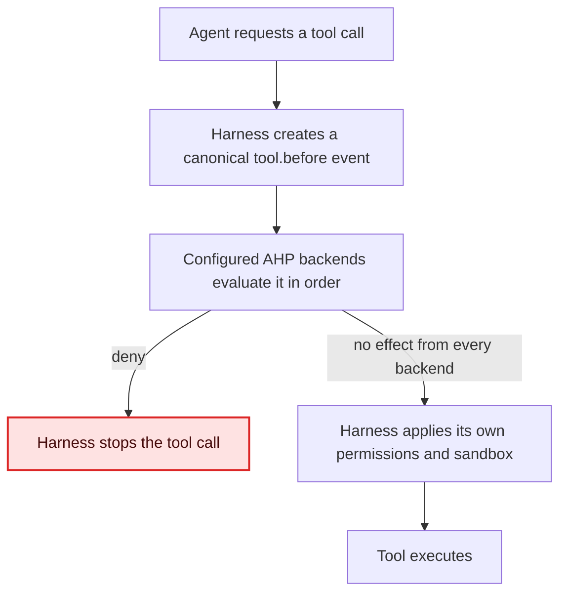

# AHP-0001: Agent Hooks Protocol v0.1 Proposal

- **Status:** Draft
- **Maturity:** Working Draft proposal
- **Protocol version:** 0.1
- **Audience:** Agent-harness implementers, compatibility-adapter authors, and policy, security, approval, and runtime-middleware vendors
- **Normative status:** Non-normative proposal and provenance record

> This tracked migration preserves the complete substantive content of the source proposal as fetched on 2026-08-25. Notion-only metadata, discussion identifiers, user identifiers, and private source links were omitted. The canonical normative Working Draft is [`../spec/working-draft.md`](../spec/working-draft.md). Differences must be proposed publicly; this document does not silently resolve the open questions in Section 23.

**Status:** Draft proposal
**Protocol version:** `0.1`
**Audience:** Agent-harness implementers, compatibility-adapter authors, and policy, security, approval, and runtime-middleware vendors

## Abstract
The Agent Hooks Protocol (AHP) defines a vendor-neutral interface through which an agent harness can ask an external backend to inspect and control an impending runtime operation.
AHP v0.1 focuses on one portable control point: intercepting a tool call before execution and returning either no effect or a denial. The protocol standardizes the event envelope, capability declaration, effect semantics, interceptor ordering, timeout behavior, failure policy, stdio and HTTP bindings, and a portable registration format.
AHP is primarily a control-plane protocol. AHP provides an optional one-way notification mode for control-adjacent audit and compatibility use cases, but observation is not required for minimum v0.1 conformance.
## Status of this proposal
This document is an initial interoperability proposal, not a final standard. It deliberately resolves enough questions to support prototypes and conformance tests while leaving broader lifecycle control, mutation, approval UI, and telemetry mapping to later versions or optional profiles.
The key words **MUST**, **MUST NOT**, **REQUIRED**, **SHALL**, **SHALL NOT**, **SHOULD**, **SHOULD NOT**, **RECOMMENDED**, **NOT RECOMMENDED**, **MAY**, and **OPTIONAL** are to be interpreted as described in [BCP 14](https://www.rfc-editor.org/info/bcp14) when, and only when, they appear in all capitals.
## 1. Problem
Current agent harnesses expose incompatible hook systems. They differ in event names, payload shapes, tool identities, process lifecycles, output codecs, timeouts, ordering, permission decisions, and failure behavior. Some use exit codes, some parse structured stdout, some invoke long-lived plugins, and some expose only fire-and-forget events.
As a result, an external policy backend cannot reliably answer a simple question—such as whether a tool call should execute—without provider-specific logic. A timeout may continue execution in one harness and stop it in another. An apparent `allow` response may mean “this hook has no objection,” “skip the host permission prompt,” or nothing at all.
AHP standardizes the boundary between a harness and a control backend. Compatibility adapters translate existing native hook dialects into AHP; conforming harnesses can implement AHP directly.
```text
Existing harness ─> compatibility adapter ─> AHP backend
Conforming harness ────────────────────────> AHP backend
```
## 2. Scope
### 2.1 Goals
AHP v0.1 aims to:
- Provide portable interception of tool calls before execution.
- Define one mandatory and unambiguous control effect: `deny`.
- Distinguish an explicit denial from a hook transport or protocol failure.
- Let the harness state which effects are valid for each request.
- Specify deterministic composition of multiple interceptors.
- Support process-per-event and persistent stdio backends.
- Support bounded HTTP request-response backends.
- Preserve stable event, session, and tool-call identity.
- Permit provider-specific fidelity data without making it portable contract data.
- Make minimum conformance small and executable.
### 2.2 Non-goals
AHP v0.1 does not:
- Replace OpenTelemetry or define metrics, logs, traces, exporters, or telemetry semantic conventions.
- Replace MCP, ACP, A2A, a tool protocol, or an agent-client protocol.
- Standardize prompts, model requests, token streams, or model responses.
- Define a universal tool-input schema.
- Replace the harness's built-in permission and sandbox systems.
- Define an effect that bypasses host permissions.
- Standardize tool-input mutation, output replacement, context injection, or user approval prompts.
- Guarantee durable audit delivery through `hooks/observe`.
- Require a daemon, service discovery system, streaming transport, or browser authorization flow.
- Standardize native provider quirks such as exit codes, environment variables, or provider-specific response objects.
## 3. AHP at a glance
AHP is a small, vendor-neutral control-plane protocol that sits in an agent harness's runtime path. It gives the harness a standard way to ask external middleware for a bounded decision before an operation continues. The protocol standardises the conversation between the harness and that middleware.
AHP creates an admission-control boundary for agent operations:

The harness remains the execution and security boundary. It owns the tool call, decides which capabilities to offer, enforces deadlines and failure policy, validates responses, and applies any effect. An AHP backend is external runtime middleware: for example, a policy engine, DLP scanner, approval service, or organization-specific security control. A compatibility adapter can translate an existing vendor hook API into the same AHP contract.
What we want to build is a small set of interoperable pieces:
- **A shared event model:** A canonical envelope and lifecycle events with stable event, session, and tool-call identity.
- **A decision protocol:** JSON-RPC methods for synchronous interception and optional one-way observation.
- **Explicit effects and capabilities:** A bounded response from the backend and an explicit list of effects the harness can enforce.
- **Predictable composition and failure behavior:** Deterministic backend ordering, deadlines, response validation, and fail-open or fail-closed behavior.
- **Portable bindings and registration:** stdio and HTTP transport rules plus a common way to configure backends and subscriptions.
- **Compatibility and conformance tooling:** Adapters for existing hook dialects and executable tests that verify equivalent behavior.
For the minimum v0.1 path, a harness is about to execute a tool call and emits `tool.before` through `hooks/intercept`. The request says that `deny` is available. Each matching backend returns either no effect or one `deny` effect. No effect means that backend has no objection; it does not bypass the harness's own permission checks. A denial stops the tool call. If a backend times out, crashes, or returns an invalid response, the harness applies that backend's configured failure policy rather than treating the failure as a decision.
AHP also defines optional `hooks/observe` notifications for lifecycle events that do not require a response. This mode supports control-adjacent audit and compatibility use cases.
This is a starting point, not the full standard. Later profiles can add effects such as requesting approval, replacing tool input, or injecting context, but only when a harness can advertise and enforce those semantics consistently.
## 4. Relationship to adjacent standards
### 4.1 OpenTelemetry
OpenTelemetry is the preferred observability standard. AHP does not prescribe whether or how harnesses emit metrics, logs, or traces; implementations that provide observability can use OpenTelemetry independently of AHP.
AHP is complementary because OpenTelemetry does not define a bounded request-response decision that pauses a tool call and applies a control effect. AHP implementations MAY carry W3C Trace Context in a namespaced extension for correlation. Core AHP conformance MUST NOT depend on OpenTelemetry support.
A future companion document MAY define an AHP-to-OpenTelemetry mapping for hook requests, denials, failures, and latency. Such a mapping is not part of this proposal.
### 4.2 MCP, ACP, and A2A
- MCP connects agents or clients to tools, resources, and context providers.
- ACP connects editors or clients to coding agents.
- A2A connects agents to other agents.
- AHP connects an agent harness to external runtime-control middleware.
AHP must work when a harness runs directly, so it is not defined as an ACP extension. AHP may intercept calls to MCP tools, but it does not change the MCP tool protocol.
### 4.3 Prior-art principles adopted by v0.1
This proposal adopts the following design guidance:
- From Kubernetes admission webhooks: distinguish an intentional rejection from a webhook failure, and configure explicit failure behavior.
- From CloudEvents: use stable event identity, typed events, timestamps, extensibility, and duplicate-aware delivery.
- From OpenFeature hooks: make hook order and lifecycle timing normative.
- From MCP transports: use UTF-8 JSON-RPC over newline-delimited stdio and keep protocol output separate from diagnostics.
- From ACP: use JSON-RPC requests for operations that expect decisions and notifications for one-way events.
- From existing cross-harness adapters: retain the native tool name and payload while exposing a small normalized projection and explicit capabilities.
## 5. Terminology and roles
<table>
<col>
<col>
<col>
</colgroup>
<tr>
<td>Term</td>
<td>Definition</td>
</tr>
<tr>
<td>**Harness**</td>
<td>The agent runtime that is about to perform an operation. It is the AHP client.</td>
</tr>
<tr>
<td>**Backend**</td>
<td>The external policy, security, approval, or middleware component receiving AHP messages. It is the AHP server.</td>
</tr>
<tr>
<td>**Interceptor**</td>
<td>A backend subscription using `intercept` mode. The harness waits for its response.</td>
</tr>
<tr>
<td>**Observer**</td>
<td>A backend subscription using `observe` mode. The harness does not wait for a decision.</td>
</tr>
<tr>
<td>**Operation**</td>
<td>The harness action represented by an event, such as a tool call.</td>
</tr>
<tr>
<td>**Effect**</td>
<td>A semantic instruction returned by an interceptor, such as `deny`.</td>
</tr>
<tr>
<td>**Operational failure**</td>
<td>A timeout, transport error, process failure, JSON-RPC error, malformed message, or invalid effect.</td>
</tr>
<tr>
<td>**Explicit denial**</td>
<td>A valid `deny` effect returned by a backend. It is not an operational failure.</td>
</tr>
<tr>
<td>**Native payload**</td>
<td>Optional provider-specific data retained for fidelity or diagnostics.</td>
</tr>
</table>
## 6. Conformance profiles
AHP v0.1 separates base protocol conformance from event-specific capability profiles. A conformance claim MUST identify:
- The implementation role: harness, backend, or both
- The implemented transport bindings: stdio, HTTP, or both
- The implemented capability profiles
An implementation cannot claim AHP v0.1 conformance from the Base Protocol profile alone. It MUST also implement at least one capability profile.
### 6.1 Base Protocol profile
Every conforming AHP v0.1 implementation MUST:
- Correctly encode every JSON-RPC message it sends and decode every JSON-RPC message it receives, as defined in Section 7.
- Apply the version and unknown-field rules defined in this proposal.
- Implement at least one v0.1 transport binding.
- Apply the requirements for every capability profile it claims.
A conforming harness MUST also:
- Validate registration before using it for agent operations.
- Reject invalid or ambiguous interceptor configuration rather than silently skipping it.
- Generate stable event identifiers and preserve them across retries.
- Validate backend responses before applying effects.
A conforming backend MUST also:
- Ignore unknown object fields in otherwise valid messages.
- Return the defined JSON-RPC error for a request whose protocol version, method, or event it cannot process; notifications never receive error responses.
- Avoid requiring optional native or extension data unless it explicitly declares a non-portable extension dependency.
### 6.2 Tool Interception profile
The Tool Interception profile is the minimum control capability defined by v0.1. It standardizes `tool.before` interception and the `deny` effect; it does not define the conceptual limit of future AHP event profiles.
To claim this profile as a harness, an implementation MUST support registration of one or more `tool.before` intercept subscriptions and MUST advertise and enforce `deny`.
Given a valid configuration containing one or more enabled intercept subscriptions for `tool.before`, when the harness is about to execute a tool call covered by those subscriptions, it MUST:
- Construct and send `tool.before` through `hooks/intercept`.
- Advertise `deny` for the event.
- Enforce each interceptor's configured deadline and failure policy.
- Execute matching interceptors serially in deterministic configuration order.
- Preserve event, session, and call identifiers across retries.
- Stop tool execution after an explicit denial or fail-closed operational failure.
- Continue to apply its own permissions, sandboxing, and approval flow if the chain completes without denial.
If no enabled intercept subscription covers `tool.before`, AHP imposes no additional decision step and the harness continues its normal authorization flow. In v0.1, a subscription covers an event only when its `events` array contains that exact event name.
To claim this profile as a backend, given a syntactically valid `hooks/intercept` request with protocol version `0.1` and event type `tool.before`, an implementation MUST return either an empty effect list or one valid `deny` effect.
### 6.3 Lifecycle Observation profile
The Lifecycle Observation profile is OPTIONAL. A conforming implementation of this profile supports `hooks/observe` and one or more events defined in Section 9.
Observation is non-blocking and best effort. It is intended for control-adjacent audit, compatibility, and correlation. It is not a replacement for OpenTelemetry or a durable event pipeline.
A conformance claim for this profile MUST identify each event type the implementation emits or accepts.
## 7. Protocol model
### 7.1 JSON-RPC
AHP uses [JSON-RPC 2.0](https://www.jsonrpc.org/specification). All messages MUST be UTF-8 encoded.
AHP v0.1 defines two methods:
<table>
<tr>
<td>Method</td>
<td>JSON-RPC type</td>
<td>Requirement</td>
<td>Purpose</td>
</tr>
<tr>
<td>`hooks/intercept`</td>
<td>Request</td>
<td>Tool Interception profile</td>
<td>Ask a backend for effects before continuing an operation.</td>
</tr>
<tr>
<td>`hooks/observe`</td>
<td>Notification</td>
<td>Lifecycle Observation profile</td>
<td>Deliver a one-way lifecycle event.</td>
</tr>
</table>
Batch JSON-RPC messages MUST NOT be used in v0.1.
### 7.2 Versioning
Every AHP params object MUST contain `protocolVersion` with the exact value `0.1`.
A backend that does not support the supplied version MUST return the AHP JSON-RPC error `unsupported_protocol_version`. Because process-per-event backends cannot rely on a prior handshake, version and capabilities are carried on each intercept request.
Compatible additive changes may be proposed within the `0.1` draft period, but published conformance artifacts MUST identify the exact schema revision they test. A later stable protocol must define a stronger negotiation and compatibility policy.
### 7.3 Unknown fields
Receivers MUST ignore unknown fields in otherwise valid objects. Senders MUST NOT infer that an ignored optional field changed backend behavior.
Unknown event types, effect types, and enum values are not ordinary unknown fields. They MUST be handled as unsupported protocol semantics.
### 7.4 JSON values
Fields described as JSON objects MUST contain objects, not encoded JSON strings. Tool input and output MAY contain any valid JSON values only where explicitly allowed by their event schema.
## 8. Common message envelope
### 8.1 Intercept request
```json
               {
  "jsonrpc": "2.0",
  "id": "evt_01JQ8Z2Y6YR0H8N7Q2M3X4V5W6",
  "method": "hooks/intercept",
  "params": {
    "protocolVersion": "0.1",
    "event": {
      "id": "evt_01JQ8Z2Y6YR0H8N7Q2M3X4V5W6",
      "source": "urn:uuid:5b7de29e-a9e0-41a8-bf26-d94b05f0656d",
      "type": "tool.before",
      "time": "2026-08-24T08:51:14Z",
      "session": {
        "id": "sess_123",
        "cwd": "/repo",
        "workspaceRoots": ["/repo"]
      },
      "tool": {
        "callId": "call_456",
        "name": "Bash",
        "kind": "shell",
        "input": {
          "command": "git push --force"
        }
      }
    },
    "capabilities": {
      "effects": ["deny"]
    }
  }
}
```
The JSON-RPC request `id` MUST equal `params.event.id`. A retry of the same event MUST reuse both values.
### 8.2 Intercept response with no effect
```json
{
  "jsonrpc": "2.0",
  "id": "evt_01JQ8Z2Y6YR0H8N7Q2M3X4V5W6",
  "result": {
    "protocolVersion": "0.1",
    "effects": []
  }
}
```
An empty effect list means only that this interceptor requests no change. It does not grant permission, override another interceptor, or bypass the harness's permission system.
### 8.3 Intercept response denying the operation
```json
{
  "jsonrpc": "2.0",
  "id": "evt_01JQ8Z2Y6YR0H8N7Q2M3X4V5W6",
  "result": {
    "protocolVersion": "0.1",
    "effects": [
      {
        "type": "deny",
        "reason": "Force pushes are prohibited by organization policy.",
        "code": "com.example.policy.force_push"
      }
    ]
  }
}
```
### 8.4 Observe notification
```json
{
  "jsonrpc": "2.0",
  "method": "hooks/observe",
  "params": {
    "protocolVersion": "0.1",
    "event": {
      "id": "evt_01JQ8Z7BEQW0X31TVPN5AZ1YJ6",
      "source": "urn:uuid:5b7de29e-a9e0-41a8-bf26-d94b05f0656d",
      "type": "tool.after",
      "time": "2026-08-24T08:51:15Z",
      "session": {
        "id": "sess_123"
      },
      "tool": {
        "callId": "call_456",
        "name": "Bash",
        "kind": "shell",
        "input": {
          "command": "git status"
        },
        "output": {
          "exitCode": 0,
          "stdout": "On branch main\n",
          "stderr": ""
        }
      }
    }
  }
}
```
A notification has no JSON-RPC `id` and MUST NOT receive a JSON-RPC response.
## 9. Event model
### 9.1 Common event fields
<table>
<tr>
<td>Field</td>
<td>Type</td>
<td>Requirement</td>
<td>Semantics</td>
</tr>
<tr>
<td>`id`</td>
<td>string</td>
<td>REQUIRED</td>
<td>Globally unique event identifier. Stable across retries.</td>
</tr>
<tr>
<td>`source`</td>
<td>string</td>
<td>REQUIRED</td>
<td>Stable, non-secret URI identifying the harness installation or runtime instance.</td>
</tr>
<tr>
<td>`type`</td>
<td>string</td>
<td>REQUIRED</td>
<td>Event type defined by this specification.</td>
</tr>
<tr>
<td>`time`</td>
<td>RFC 3339 string</td>
<td>REQUIRED</td>
<td>Time at which the harness created the event.</td>
</tr>
<tr>
<td>`session`</td>
<td>object</td>
<td>REQUIRED</td>
<td>Session identity and optional execution context.</td>
</tr>
<tr>
<td>`tool`</td>
<td>object</td>
<td>Tool events only</td>
<td>Tool-call identity and event-specific data.</td>
</tr>
<tr>
<td>`native`</td>
<td>object</td>
<td>OPTIONAL</td>
<td>Provider-specific fidelity payload. Disabled by default.</td>
</tr>
<tr>
<td>`extensions`</td>
<td>object</td>
<td>OPTIONAL</td>
<td>Namespaced extension data.</td>
</tr>
</table>
`id` MUST be unique across events produced by a harness. UUIDv4, UUIDv7, and suitably generated ULIDs are acceptable examples; the protocol does not require a specific algorithm.
`source` SHOULD remain stable for the life of the harness installation. It MUST NOT contain access tokens, user secrets, raw prompts, or other sensitive data.
### 9.2 Session object
<table>
<tr>
<td>Field</td>
<td>Type</td>
<td>Requirement</td>
<td>Semantics</td>
</tr>
<tr>
<td>`id`</td>
<td>string</td>
<td>REQUIRED</td>
<td>Stable session identifier.</td>
</tr>
<tr>
<td>`cwd`</td>
<td>string</td>
<td>OPTIONAL</td>
<td>Current working directory at event creation.</td>
</tr>
<tr>
<td>`workspaceRoots`</td>
<td>string array</td>
<td>OPTIONAL</td>
<td>Workspace roots visible to the harness.</td>
</tr>
<tr>
<td>`model`</td>
<td>string</td>
<td>OPTIONAL</td>
<td>Harness-reported model identifier.</td>
</tr>
<tr>
<td>`agent`</td>
<td>object</td>
<td>OPTIONAL</td>
<td>Current subagent identity, if applicable.</td>
</tr>
</table>
Paths and model identifiers may be sensitive. A harness MUST permit implementations or administrators to omit optional session fields.
If present, `agent` has a required `id` and an optional provider-defined `type`.
### 9.3 Tool object
<table>
<tr>
<td>Field</td>
<td>Type</td>
<td>Requirement</td>
<td>Semantics</td>
</tr>
<tr>
<td>`callId`</td>
<td>string</td>
<td>REQUIRED</td>
<td>Stable identifier for this invocation within the session.</td>
</tr>
<tr>
<td>`name`</td>
<td>string</td>
<td>REQUIRED</td>
<td>Tool name as exposed by the harness, preserved verbatim.</td>
</tr>
<tr>
<td>`kind`</td>
<td>string</td>
<td>REQUIRED</td>
<td>Coarse portable classification defined below.</td>
</tr>
<tr>
<td>`input`</td>
<td>object</td>
<td>`tool.before`, `tool.after`, `tool.error`</td>
<td>Parsed tool input. MUST be a JSON object.</td>
</tr>
<tr>
<td>`output`</td>
<td>any JSON value</td>
<td>`tool.after` only</td>
<td>Successful tool output, subject to redaction and size limits.</td>
</tr>
<tr>
<td>`error`</td>
<td>object</td>
<td>`tool.error` only</td>
<td>Tool failure information.</td>
</tr>
<tr>
<td>`mcp`</td>
<td>object</td>
<td>OPTIONAL</td>
<td>MCP server and tool identity when known.</td>
</tr>
</table>
`callId` MUST remain identical across the `tool.before`, `tool.after`, and `tool.error` events for one tool invocation. If a native harness does not supply an ID, an adapter MUST synthesize a stable ID. A deterministic hash of session identity, turn identity, tool name, and input is one acceptable strategy.
The v0.1 `kind` values are:
- `shell`
- `file_read`
- `file_write`
- `file_edit`
- `search`
- `fetch`
- `task`
- `mcp`
- `other`
`kind` is deliberately coarse. It supports portable broad policy, such as denying all shell execution, without claiming that arbitrary tool input schemas are portable. `name` and `input` retain the harness representation. A future tool-projection profile may standardize selected inputs, but that work is out of scope here.
If present, `mcp` MAY contain `server`, `tool`, and transport metadata. Only `server` and `tool` are candidates for future portable semantics; transport metadata is informational.
### 9.4 Native payload
The optional `native` object has this shape:
```json
{
  "provider": "claude-code",
  "eventName": "PreToolUse",
  "payload": {}
}
```
A harness MUST omit `native` unless native-payload delivery is enabled by local policy. A portable backend MUST function when `native` is absent. Native fields MUST NOT change the semantics of a core effect.
### 9.5 Extensions
Extension keys MUST use reverse-DNS namespacing, such as `com.example.policy` or `org.w3c.trace_context`. Unnamespaced extension keys are invalid.
Extension values MAY contain any JSON value. Core implementations MUST preserve extensions when proxying an otherwise unchanged event, but they MUST NOT interpret unknown extensions.
A Trace Context extension might look like:
```json
{
  "extensions": {
    "org.w3c.trace_context": {
      "traceparent": "00-0af7651916cd43dd8448eb211c80319c-b7ad6b7169203331-01",
      "tracestate": "congo=t61rcWkgMzE"
    }
  }
}
```
This extension provides correlation only. Its presence does not make OpenTelemetry part of AHP conformance.
## 10. Event lifecycle
### 10.1 `tool.before`
`tool.before` is the only interceptable event in v0.1.
The harness MUST create it after the tool name and input are finalized for execution but before the tool causes any external side effect. AHP interception SHOULD occur before the harness displays its own permission prompt so an operation denied by organization policy does not generate an unnecessary prompt.
A no-effect result means the harness continues its normal authorization and execution flow. It MUST NOT bypass built-in permissions, sandboxing, or user confirmation.
If any interceptor denies the event, the harness MUST NOT execute the tool. The harness SHOULD present the denial reason to the user or agent unless local policy marks backend reasons as sensitive.
### 10.2 `tool.after`
`tool.after` is an optional observation event emitted after successful tool completion. It MUST reuse the `callId` from `tool.before`.
The output may be large or sensitive. Harnesses SHOULD support truncation, redaction, or omission and SHOULD indicate those transformations through a namespaced extension.
### 10.3 `tool.error`
`tool.error` is an optional observation event emitted when an attempted tool execution fails. It MUST NOT be emitted merely because an AHP interceptor denied the call.
The `error` object MUST contain `message` and MAY contain `code`, `category`, and provider-specific extension data.
### 10.4 `session.start`
`session.start` is an optional observation event emitted when the harness creates a session. It SHOULD be the first AHP event for the session when supported.
### 10.5 `session.end`
`session.end` is an optional observation event emitted when the harness knows a session has ended. Delivery is best effort because a harness crash or forced process termination may prevent it.
The event MAY contain an `outcome` value of `completed`, `cancelled`, `error`, or `unknown`.
## 11. Capabilities
Every `hooks/intercept` request MUST include:
```json
{
  "capabilities": {
    "effects": ["deny"]
  }
}
```
A harness claiming the v0.1 Tool Interception profile MUST advertise `deny` for `tool.before`. A backend MUST return only effects advertised in that request.
Returning an unadvertised effect is an operational protocol failure, not an implicit no-op. The harness MUST apply the interceptor's configured failure policy.
Capabilities describe the current event and runtime, not only the harness product. A backend MUST NOT infer capabilities from provider name, provider version, transport, or native payload.
Future standards may define additional core effects. Experimental effects MUST use reverse-DNS names, and the harness must advertise the exact extension effect before a backend returns it.
## 12. Effects
### 12.1 Effect list
A successful intercept result MUST contain `effects`, which MUST be a JSON array.
For v0.1, the array MUST contain either:
- No effects, or
- Exactly one `deny` effect.
Multiple `deny` effects from one backend are invalid. Effect ordering and combinations are reserved for a later version.
### 12.2 `deny`
<table>
<tr>
<td>Field</td>
<td>Type</td>
<td>Requirement</td>
<td>Semantics</td>
</tr>
<tr>
<td>`type`</td>
<td>string</td>
<td>REQUIRED</td>
<td>Exact value `deny`.</td>
</tr>
<tr>
<td>`reason`</td>
<td>string</td>
<td>REQUIRED</td>
<td>Non-empty human-readable explanation.</td>
</tr>
<tr>
<td>`code`</td>
<td>string</td>
<td>OPTIONAL</td>
<td>Stable machine-readable reverse-DNS identifier.</td>
</tr>
<tr>
<td>`extensions`</td>
<td>object</td>
<td>OPTIONAL</td>
<td>Namespaced backend metadata.</td>
</tr>
</table>
A valid `deny` effect is an explicit policy result. It MUST deny regardless of whether the interceptor is configured `fail-open` or `fail-closed`.
A backend SHOULD avoid placing secrets, stack traces, or sensitive policy internals in `reason` because the harness may show it to a user or model.
### 12.3 No `allow` effect
AHP v0.1 has no `allow` effect. An empty effect list means only that the current backend has no objection. It's not possible to:
- Skip remaining interceptors.
- Override a denial.
- Bypass a host permission prompt.
- Disable sandboxing.
- Grant a tool capability.
This distinction avoids importing incompatible provider meanings of “allow.”
## 13. Composition
### 13.1 Interceptor order
The portable registration document uses an ordered `hooks` array. For a given event, the harness MUST evaluate matching interceptors serially in array order.
For each interceptor:
1. The harness sends `hooks/intercept`.
2. If the result has no effects, the harness proceeds to the next interceptor.
3. If the result contains `deny`, the harness stops the chain and denies the operation.
4. If an operational failure occurs under `fail-open`, the harness records the failure locally and proceeds to the next interceptor.
5. If an operational failure occurs under `fail-closed`, the harness stops the chain and denies the operation.
This order is normative. Harnesses MUST NOT run interceptors concurrently in v0.1.
### 13.2 Observers
Observer delivery MUST NOT delay the interceptor chain or tool execution. A harness MAY dispatch observer notifications concurrently.
Ordering between observer delivery and interceptor completion is unspecified. Backends that make control decisions are responsible for exporting their own durable decision audit, preferably through OpenTelemetry or another dedicated audit pipeline.
### 13.3 Overlapping subscriptions
A registration document MUST NOT configure the same backend more than once for the same event and mode. A harness MUST reject ambiguous duplicate subscriptions at configuration load time.
## 14. Failure semantics
### 14.1 Failure classes
The following are operational failures:
- Deadline exceeded
- Connection refused, reset, or lost
- Backend process launch failure or abnormal exit
- Non-success HTTP response
- Malformed UTF-8, JSON, or JSON-RPC
- Mismatched JSON-RPC request and response IDs
- JSON-RPC error response
- Unsupported protocol version or event
- Missing required result fields
- Unadvertised, unknown, malformed, or conflicting effects
- Backend response received after the deadline
An explicit `deny` is not an operational failure.
### 14.2 Failure policy
Each intercept subscription MUST explicitly configure one of:
- `fail-open`: Continue unchanged after an operational failure.
- `fail-closed`: Deny the operation after an operational failure.
There is no implicit default for intercept subscriptions. Requiring an explicit value prevents a security-sensitive deployment from inheriting an unexpected default.
Observe subscriptions are always non-blocking and effectively fail open. They MUST NOT specify `failurePolicy`.
### 14.3 Synthetic denial
For a fail-closed operational failure, the harness SHOULD present a generic local reason such as “Required policy backend unavailable.” It SHOULD NOT expose network details, credentials, stack traces, or malformed backend content to the model.
A synthetic denial generated by fail-closed behavior MUST be distinguishable in local audit records from an explicit backend denial.
### 14.4 Deadlines
Every intercept subscription MUST specify `timeoutMs` as a positive integer. A harness MUST enforce the timeout across connection setup, request transmission, backend processing, and response parsing.
A harness SHOULD support values from 100 ms through 30,000 ms. Deployments SHOULD choose the smallest value compatible with the backend because interception is on the agent's critical path.
When the deadline expires, the harness MUST ignore any later response and apply failure policy. Cancellation signaling is out of scope for v0.1.
## 15. Duplicate delivery and retries
A harness MAY retry an intercept request only while the original deadline remains active. Every retry MUST reuse the same event ID, JSON-RPC ID, session ID, call ID, and event contents.
A backend SHOULD treat repeated event IDs from the same source as duplicate delivery and return the same semantic result. A backend that performs side effects SHOULD use `(source, event.id)` as an idempotency key.
An observer transport MAY retry a failed notification when it can detect delivery failure. Retries MUST reuse the event ID. Observation remains best effort; AHP v0.1 does not guarantee at-least-once or exactly-once delivery.
A harness MUST NOT retry an explicit denial or a successful empty-effect response.
## 16. JSON-RPC errors
Backends use standard JSON-RPC error responses. AHP reserves these server-error codes:
<table>
<tr>
<td>Code</td>
<td>Name</td>
<td>Meaning</td>
</tr>
<tr>
<td>`-32001`</td>
<td>`unsupported_protocol_version`</td>
<td>Backend does not support `params.protocolVersion`.</td>
</tr>
<tr>
<td>`-32002`</td>
<td>`unsupported_event`</td>
<td>Backend does not support the supplied event type in this method.</td>
</tr>
<tr>
<td>`-32003`</td>
<td>`backend_unavailable`</td>
<td>Backend is temporarily unable to evaluate the request.</td>
</tr>
<tr>
<td>`-32004`</td>
<td>`backend_internal_error`</td>
<td>Backend failed while evaluating the request.</td>
</tr>
</table>
Example:
```json
{
  "jsonrpc": "2.0",
  "id": "evt_01JQ8Z2Y6YR0H8N7Q2M3X4V5W6",
  "error": {
    "code": -32001,
    "message": "Unsupported AHP protocol version",
    "data": {
      "supported": ["0.1"]
    }
  }
}
```
Any JSON-RPC error is an operational failure and is handled using the subscription's failure policy. Error `data` MUST NOT contain secrets.
## 17. Transport
### 17.1 stdio binding
#### 17.1.1 Framing
Each message MUST be one complete JSON-RPC object encoded as UTF-8 and terminated by a single newline. A message MUST NOT contain a literal unescaped newline inside the JSON text.
The backend reads protocol messages from `stdin` and writes protocol messages to `stdout`. It MAY write UTF-8 diagnostics to `stderr`.
The backend MUST NOT write banners, logs, progress indicators, or other non-protocol content to `stdout`.
#### 17.1.2 Persistent lifecycle
A persistent backend remains alive for multiple messages. The harness MUST correlate responses by JSON-RPC ID and MAY have only one outstanding v0.1 intercept request per persistent backend because interceptor evaluation is serial.
The harness SHOULD terminate a persistent backend that repeatedly emits malformed protocol output.
#### 17.1.3 Process-per-event lifecycle
A process-per-event backend receives exactly one JSON-RPC message on `stdin`, followed by EOF. It writes at most one response and exits.
For an intercept request, exit status `0` indicates that the process completed its protocol exchange. The response body, not the process exit code, determines the semantic effect. Any nonzero exit, missing response, or malformed response is an operational failure.
For an observe notification, the harness does not wait for a semantic response. Process status may be recorded locally but cannot affect agent execution.
#### 17.1.4 Process security
The harness MUST invoke the configured command and argument array directly without implicit shell interpolation. It SHOULD provide the smallest practical environment and MUST NOT place bearer tokens or unrelated credentials in event payloads.
### 17.2 HTTP binding
#### 17.2.1 Request and response
The harness sends each JSON-RPC message as the body of a new HTTP `POST` request.
Requirements:
- Request and response bodies MUST use `Content-Type: application/json`.
- The body MUST contain one JSON-RPC object, not a batch.
- A successful intercept response MUST use HTTP status `200` and contain the JSON-RPC response.
- A successfully accepted observe notification SHOULD use `202 Accepted` or `204 No Content` and no JSON-RPC response.
- Any other HTTP status is an operational failure.
- Redirects MUST NOT be followed unless explicitly enabled for the configured endpoint.
AHP v0.1 does not use SSE, streaming responses, or a corresponding HTTP `GET` endpoint.
#### 17.2.2 TLS
Remote endpoints MUST use `https`. Plain `http` MAY be used only for loopback addresses or explicitly controlled local development environments.
Implementations MUST validate server certificates using platform trust policy unless a deployment explicitly configures a narrower trust root. Disabling certificate validation is NOT RECOMMENDED.
#### 17.2.3 Authentication
AHP v0.1 defines one portable HTTP authentication profile: static bearer authentication through a credential reference.
The registration document names an environment variable or implementation-defined secret reference. The harness resolves it at runtime and sends:
```text
Authorization: Bearer <token>
```
The literal token MUST NOT appear in the portable registration document, event payload, logs, denial reason, or JSON-RPC error data.
OAuth 2.1, mTLS, workload identity, signed requests, and service discovery are out of scope for the portable v0.1 HTTP binding.
## 18. Portable registration
### 18.1 Document shape
A portable registration document is a JSON object with an ordered `hooks` array.
```json
{
  "protocolVersion": "0.1",
  "hooks": [
    {
      "id": "com.example.policy",
      "transport": {
        "type": "http",
        "url": "https://policy.example.com/agent-hooks"
      },
      "authentication": {
        "type": "bearer",
        "tokenEnv": "AHP_POLICY_TOKEN"
      },
      "subscriptions": [
        {
          "events": ["tool.before"],
          "mode": "intercept",
          "timeoutMs": 750,
          "failurePolicy": "fail-closed"
        }
      ]
    },
    {
      "id": "com.example.local-review",
      "transport": {
        "type": "stdio",
        "command": "/usr/local/bin/local-review",
        "args": ["serve"],
        "lifecycle": "persistent"
      },
      "subscriptions": [
        {
          "events": ["tool.before"],
          "mode": "intercept",
          "timeoutMs": 500,
          "failurePolicy": "fail-open"
        }
      ]
    }
  ]
}
```
### 18.2 Backend fields
<table>
<tr>
<td>Field</td>
<td>Requirement</td>
<td>Semantics</td>
</tr>
<tr>
<td>`id`</td>
<td>REQUIRED</td>
<td>Unique reverse-DNS backend identifier within the document.</td>
</tr>
<tr>
<td>`transport`</td>
<td>REQUIRED</td>
<td>Exactly one supported transport configuration.</td>
</tr>
<tr>
<td>`authentication`</td>
<td>HTTP bearer only</td>
<td>Credential reference; never a literal credential.</td>
</tr>
<tr>
<td>`subscriptions`</td>
<td>REQUIRED</td>
<td>Non-empty array of event subscriptions.</td>
</tr>
</table>
### 18.3 Subscription fields
<table>
<tr>
<td>Field</td>
<td>Requirement</td>
<td>Semantics</td>
</tr>
<tr>
<td>`events`</td>
<td>REQUIRED</td>
<td>Non-empty array of exact event names. No matcher language in v0.1.</td>
</tr>
<tr>
<td>`mode`</td>
<td>REQUIRED</td>
<td>`intercept` or `observe`.</td>
</tr>
<tr>
<td>`timeoutMs`</td>
<td>Intercept only</td>
<td>Required positive integer deadline.</td>
</tr>
<tr>
<td>`failurePolicy`</td>
<td>Intercept only</td>
<td>Required `fail-open` or `fail-closed`.</td>
</tr>
<tr>
<td>`includeNative`</td>
<td>OPTIONAL</td>
<td>Boolean; defaults to `false`.</td>
</tr>
</table>
An `intercept` subscription MUST contain only `tool.before` in v0.1. An `observe` subscription MUST NOT include `timeoutMs` or `failurePolicy`.
### 18.4 stdio transport fields
A stdio transport contains:
- `type`: exact value `stdio`
- `command`: executable path or name
- `args`: optional string array
- `lifecycle`: `persistent` or `per_event`
- `cwd`: optional backend working directory
### 18.5 HTTP transport fields
An HTTP transport contains:
- `type`: exact value `http`
- `url`: absolute endpoint URL
A bearer authentication object contains:
- `type`: exact value `bearer`
- `tokenEnv`: environment variable containing the token
Implementations MAY support additional local secret-reference forms, but portable documents cannot assume them.
### 18.6 Native harness configuration
A harness MAY translate this registration model into its native configuration format. It may still claim protocol conformance if the resulting order, subscriptions, timeout, failure, transport, and credential semantics are equivalent.
## 19. Privacy and security
### 19.1 Sensitive data
Tool input, output, paths, model identifiers, native payloads, and denial reasons can contain sensitive data. Harnesses and backends SHOULD minimize collection and SHOULD support redaction, size limits, and retention controls.
Native payload delivery MUST default to disabled. Tool output is not needed for Tool Interception profile conformance.
### 19.2 Authorization boundary
AHP is an additional restriction point, not an authority-escalation mechanism. No AHP response can grant a capability that the harness, user, sandbox, or operating system has not granted.
The host remains responsible for validating and applying effects. Backends MUST be treated as untrusted input even when authenticated.
### 19.3 Availability
Fail-closed policy can make a backend outage stop agent work. Deployments should use bounded timeouts, health monitoring, local caching where safe, and carefully chosen failure policy.
Fail-open policy preserves availability but may weaken external enforcement. The registration must make that tradeoff explicit.
### 19.4 Replay and duplicates
Bearer authentication does not prevent replay by an attacker who obtains a valid token and payload. Security-sensitive remote deployments SHOULD use short-lived credentials and MAY add an authenticated request-signing extension before such a mechanism becomes standardized.
Backend side effects should be idempotent by event ID.
### 19.5 Extension trust
Unknown extensions and native payloads MUST NOT be interpreted as trusted authorization claims. A backend that uses an extension for policy must separately establish its producer and integrity assumptions.
## 20. Conformance tests
The v0.1 project should publish JSON Schemas, fixtures, and a conformance runner. Test reports MUST identify the implementation role, transport binding, and capability profiles under test.
### 20.1 Base Protocol tests
Every conforming implementation test suite should verify, as applicable to its role:
- Correct JSON-RPC envelope and version handling
- Unknown object fields are ignored
- Unsupported versions, methods, and events produce defined errors
- stdio framing and stdout discipline for the stdio binding
- HTTP status and content-type handling for the HTTP binding
- Literal credentials never enter payloads
- Native payload omission by default
Harness tests should additionally verify registration validation, response validation, and stable event IDs. Backend tests should additionally verify response ID correlation and portable behavior without `native` or `extensions`.
### 20.2 Tool Interception harness tests
A harness claiming the Tool Interception profile should verify:
- No AHP decision step occurs when no enabled subscription covers `tool.before`
- Correct `hooks/intercept` request shape and JSON-RPC/event ID equality
- Required `tool.before` fields
- Stable event, session, and call IDs across retries
- `input` is an object rather than encoded JSON
- `deny` prevents tool execution
- Empty effects do not bypass host permissions
- Serial interceptor order
- Explicit denial short-circuits the chain
- Fail-open continues after each failure class
- Fail-closed denies after each failure class
- Deadline enforcement and late-response rejection
- Unsupported effects are protocol failures
### 20.3 Tool Interception backend tests
A backend claiming the Tool Interception profile should verify:
- Valid empty-effect response
- Valid denial response
- Response IDs match request IDs
- Duplicate IDs produce equivalent semantic results
- Denial reasons and errors do not leak secrets
### 20.4 Lifecycle Observation tests
Implementations claiming the Lifecycle Observation profile should additionally verify:
- Notifications contain no JSON-RPC ID
- No response is emitted for notifications
- Observer failure never affects tool execution
- Supported event types are included in the conformance claim
- Retries reuse event IDs
## 21. Compatibility-adapter requirements
An adapter translating a native hook system into AHP MUST:
- Hide provider-specific exit codes and response shapes from the AHP backend.
- Preserve the native tool name.
- Parse tool input into a JSON object.
- Assign a v0.1 `kind` or use `other`.
- Synthesize stable call IDs when the provider omits them.
- Advertise only effects the current native event can enforce.
- Translate `deny` into the provider's actual blocking mechanism.
- Apply configured failure policy honestly.
- Never claim fail-closed enforcement for an event the provider cannot block.
- Keep provider-specific fields in `native` or namespaced extensions.
An adapter MUST NOT silently discard an unsupported effect. If the native harness cannot enforce `deny` for `tool.before`, the adapter does not conform to the Tool Interception profile for that path.
## 22. Design rationale
### 22.1 Why only `deny`?
Cross-harness research shows that denial is the smallest broadly meaningful control capability. Approval prompts, forced allow, input mutation, output replacement, context injection, and agent continuation differ significantly across harnesses.
Starting with one effect makes conformance meaningful. It also prevents the first release from standardizing ambiguous semantics merely because similar provider fields exist.
### 22.2 Why capabilities if v0.1 has one effect?
Capabilities make requests self-describing and establish the evolution mechanism needed by heterogeneous harnesses. They also prevent a backend from assuming behavior from a provider name.
The small redundancy in v0.1 is preferable to adding provider detection or an incompatible handshake later.
### 22.3 Why no `allow`?
Existing systems use “allow” for incompatible concepts. An empty result cleanly means “this backend does not deny,” while the harness remains responsible for all other authorization.
### 22.4 Why JSON-RPC?
JSON-RPC already provides request, response, error, notification, and correlation semantics. MCP and ACP demonstrate that it can be used across local and remote agent transports. AHP needs only a bounded subset and does not copy MCP's streaming HTTP behavior.
### 22.5 Why ordered serial composition?
Control decisions must be deterministic. Serial order is easy to explain and test. It avoids races between denials and prepares for future mutation effects, where each backend may need to see the prior backend's accepted changes.
### 22.6 Why is observe optional?
Many harnesses already support OpenTelemetry, and telemetry should converge there. AHP observe mode remains useful for compatibility and control-adjacent audit, but making it part of minimum conformance would blur the protocol's purpose and create a competing event-export path.
### 22.7 Why keep native payloads?
Adapters need lossless diagnostics when providers drift or expose events that the portable model does not represent. Making native data optional and off by default preserves that escape hatch without allowing it to become the contract.
## 23. Open questions for v0.1 review
1. Is the coarse `tool.kind` taxonomy useful and stable enough to require, or should it be optional until a separate tool-projection profile exists?
2. Should globally unique `event.id` be required, or should uniqueness be defined as the CloudEvents-style pair `(source, id)`?
3. Is exact version matching acceptable during v0.x, or should v0.1 define a stateless supported-version range?
4. Should HTTP notification success require `202`, permit `204`, or allow any successful 2xx status?
5. Should `timeoutMs` have a normative maximum rather than only a recommended supported range?
6. Should persistent stdio permit multiple outstanding requests in a later profile?
7. Is reverse-DNS naming sufficient for extensions and policy codes?
8. Should `native` live in the core envelope or be defined entirely as an extension?
9. Does a denied tool call need a separate optional `tool.denied` observation event?
10. Which fields need explicit maximum sizes in the first conformance schema?
11. Should authentication and registration remain in the same document as core protocol semantics or become separate bindings?
12. Which optional effect should be standardized next: `ask`, `replace_tool_input`, or `add_context`?
## 24. Proposed implementation plan
1. Publish a JSON Schema for the common envelope, `tool.before`, `deny`, and registration document.
2. Add golden request and response fixtures for stdio and HTTP.
3. Implement an AHP encoder and decoder in `agenthooks` while preserving its native adapter layer.
4. Build a fake backend that can return no effect, deny, malformed output, timeout, and JSON-RPC errors.
5. Build a harness conformance runner covering ordering and failure policy.
6. Test adapters for at least two native harness dialects.
7. Implement one independent policy backend.
8. Resolve the open questions using implementation evidence before declaring v0.1 stable.
## 25. References
- [Speakeasy ](https://github.com/speakeasy-api/agenthooks/blob/main/DESIGN.md)[`agenthooks`](https://github.com/speakeasy-api/agenthooks/blob/main/DESIGN.md)[ design](https://github.com/speakeasy-api/agenthooks/blob/main/DESIGN.md)
- [DeepSeek shared Claude Code and Codex hook-protocol note](https://github.com/deepseek-ai/deepseek-harness/blob/master/.agents/notes/implemented/feature/2026-06-30-hook-protocol-lib.md)
- [JSON-RPC 2.0 specification](https://www.jsonrpc.org/specification)
- [Model Context Protocol: transports](https://modelcontextprotocol.io/specification/2025-06-18/basic/transports)
- [Model Context Protocol: authorization](https://modelcontextprotocol.io/specification/2025-06-18/basic/authorization)
- [Agent Client Protocol overview](https://github.com/agentclientprotocol/agent-client-protocol/blob/main/docs/protocol/v2/overview.mdx)
- [Kubernetes dynamic admission control](https://kubernetes.io/docs/reference/access-authn-authz/extensible-admission-controllers/)
- [CloudEvents specification](https://github.com/cloudevents/spec/blob/main/cloudevents/spec.md)
- [OpenFeature hooks](https://openfeature.dev/specification/sections/hooks/)
- [OpenTelemetry GenAI semantic conventions](https://opentelemetry.io/docs/specs/semconv/registry/attributes/gen-ai/)
- [W3C Trace Context](https://www.w3.org/TR/trace-context/)
- [BCP 14 / RFC 2119 and RFC 8174](https://www.rfc-editor.org/info/bcp14)
